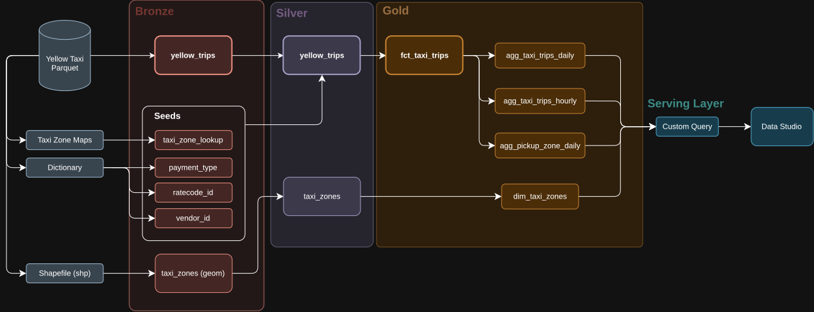
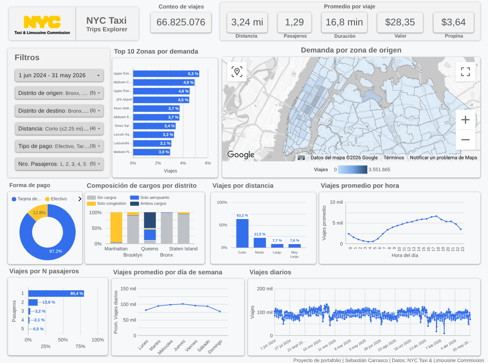
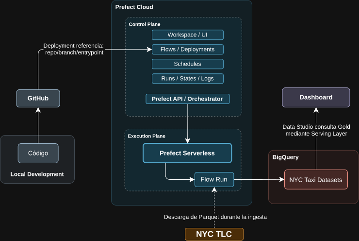

# NYC Yellow Taxi 

Pipeline de datos construido sobre los **NYC Yellow Taxi Trip Records** publicados por NYC TLC.

El proyecto implementa ingesta incremental con `dlt`, modelado y testing con `dbt`, almacenamiento en **BigQuery**, orquestación con **Prefect Cloud** y visualización en **Data Studio** (antes Looker Studio).

El pipeline está diseñado para procesar archivos Parquet mensuales de forma incremental, idempotente y reproducible.


## 1. Arquitectura

<p align="center">
  
</p>

La ejecución mensual es coordinada mediante **Prefect Cloud**


## 2. Stack 

- Python 3.12
- dlt
- dbt Core
- BigQuery
- Prefect Cloud 
- Data Studio (a.k.a Looker Studio)


## 3. Estructura

```text
nyc-yellow-taxi/
├── nyc_yellow_taxi/
│   ├── config.py
│   ├── ingestion/
│   │   ├── load_yellow_trips.py
│   │   └── load_taxi_zones_shp.py
│   └── orchestration/
│       ├── monthly_pipeline.py
│       ├── backfill_pipeline.py
│       └── deploy.py
│
├── dbt/
│   └── nyc_yellow_taxi/
│       ├── models/
│       │   ├── silver/
│       │   │   ├── yellow_trips.sql
│       │   │   ├── taxi_zones.sql
│       │   │   ├── schema.yml
│       │   │   └── unit_tests.yml
│       │   ├── gold/
│       │   │   ├── fct_taxi_trips.sql
│       │   │   ├── agg_taxi_trips_daily.sql
│       │   │   ├── agg_taxi_trips_hourly.sql
│       │   │   ├── agg_pickup_zone_daily.sql
│       │   │   ├── dim_taxi_zones.sql
│       │   │   └── schema.yml
│       │   └── sources.yml
│       ├── macros/
│       │   └── cleanup_retention.sql
│       ├── seeds/
│       │   ├── payment_type.csv
│       │   ├── ratecode_id.csv
│       │   ├── taxi_zone_lookup.csv
│       │   └── vendor_id.csv
│       ├── tests/
│       │   └── test_agg_daily_matches_fact.sql
│       ├── dbt_project.yml
│       └── profiles.yml
│
├── dashboard_config/
│   ├── dashboard_serving_query.sql
│   └── README.md
│
├── data/
│   └── taxi_zones/
│       └── taxi_zones.*
│
├── config.yaml
├── pyproject.toml
├── poetry.lock
├── LICENSE
└── README.md
```


## 4. Modelo de datos

El proyecto sigue una arquitectura **Medallion**.

### Bronze 🟤

Contiene los datos ingeridos desde los archivos Parquet publicados por NYC TLC.

Cada batch se identifica mediante:

```text
source_file_month
```

La reingesta de un mismo mes es idempotente y reemplaza el batch correspondiente.

### Silver ⚪


`yellow_trips` aplica limpieza, normalización, enriquecimiento y deduplicación.

Utiliza:

```text
materialization: incremental
strategy: merge
unique_key: trip_id
```

La precedencia entre distintas versiones de un mismo viaje considera:

```text
1. source_file_month
2. ingested_at
```

Esto evita que un batch histórico sobrescriba una versión proveniente de un batch más reciente.

### Gold 🟡

La capa Gold contiene la fact principal y agregaciones optimizadas para consumo analítico:

```text
fct_taxi_trips
agg_taxi_trips_daily
agg_taxi_trips_hourly
agg_pickup_zone_daily
dim_taxi_zones
```

`fct_taxi_trips` utiliza estrategia incremental `merge`.

Las tablas agregadas utilizan `insert_overwrite` y reconstruyen únicamente las fechas afectadas por el batch procesado.


### Late-arriving data

Los archivos mensuales pueden contener viajes cuya fecha de pickup pertenece al mes anterior.

Los modelos detectan las fechas afectadas por cada `source_file_month` y reconstruyen completamente esas particiones desde `fct_taxi_trips`.

La operación mensual conserva suficiente detalle histórico para poder reconstruir correctamente estas fechas.

> [!IMPORTANT]
> La lógica mensual está diseñada para procesar el batch más reciente de forma secuencial. Reprocesar arbitrariamente un mes histórico cuyo detalle ya fue eliminado por la política de retención puede no disponer del contexto necesario para reconstruir correctamente los registros tardíos.


## 5. Política de retención

Para mantener bajo el consumo de almacenamiento en BigQuery se utiliza una **estrategia de retención por capas (Tiered Retention)**:

```text
Bronze detail    → 3 meses
Silver detail    → 3 meses
Gold fact        → 3 meses
Gold aggregates  → 24 meses
```

Las dimensiones estáticas se conservan completas.

Los datos históricos pueden reconstruirse nuevamente desde la fuente pública de NYC TLC.


## 6. Serving layer y dashboard

Data Studio consume una **Custom Query** parametrizada almacenada como referencia en:

```text
dashboard_config/dashboard_serving_query.sql
```

La consulta unifica distintos granos analíticos mediante el campo `row_type` con los valores:

```text
daily
daily_series
hourly
map
```

`daily_series` y `hourly` generan explícitamente fechas y horas sin actividad para evitar sesgos en métricas promedio.

El dashboard utiliza seis filtros globales:

```text
Periodo
Distrito de origen
Distrito de destino
Distancia
Tipo de pago
Número de pasajeros
```

La geometría de las zonas se incorpora únicamente después de agregar las métricas por zona, evitando repetir polígonos innecesariamente.

> [!NOTE]
> El cross-filtering entre gráficos está deshabilitado intencionalmente. Los filtros globales del dashboard se implementan mediante parámetros para mantener consistencia entre los distintos granos expuestos por la serving layer.

<p align="center">
  
</p>


## 7. Orquestación

La orquestación se realiza mediante Prefect Cloud.

### Arquitectura de ejecución

Prefect Cloud actúa como control plane del proyecto, mientras que los runs se ejecutan en infraestructura Serverless. Los deployments referencian el código versionado en GitHub y los flows interactúan directamente con NYC TLC y BigQuery durante la ejecución.

<p align="center">
  
</p>

### Deployment mensual

```text
monthly-taxi-prod
```

Se ejecuta automáticamente:

```text
Día 5 de cada mes
06:00
America/Santiago
```

El mes objetivo corresponde al primer día del mes actual **menos cuatro meses**. Esto para garantizar que la ingesta se encuentre con datos disponibles en el [Sitio oficial de NYC TLC](https://www.nyc.gov/site/tlc/about/tlc-trip-record-data.page) debido al delay observado en la publicación de los datos.

Ejemplo:

```text
Mes actual: 2026-10 (Octubre)
→ batch objetivo: 2026-06-01 (Junio)
```

### Backfill

Existe además un deployment manual:

```text
backfill-taxi-manual
```

utilizado para cargar rangos históricos de manera secuencial.

> [!WARNING]
> Los backfills deben ejecutarse sobre rangos continuos y en orden cronológico. Cuando se requiera reconstruir correctamente el inicio de un período, puede ser necesario incluir un mes anterior como contexto para los registros tardíos.


## 8. Monitoreo

Prefect posee una automatización asociada al pipeline mensual.

Se envía una notificación por email cuando un flow run entra en estado:

```text
Failed ❌
Crashed ⚠️
```


## 9. Tests

El proyecto utiliza tests de dbt para validar:

- valores `not_null`
- unicidad
- rangos válidos
- consistencia de dimensiones
- lógica incremental
- reconciliación entre fact y agregados

También existen unit tests para verificar la precedencia entre versiones de un mismo `trip_id`.

El agregado diario incluye un test de reconciliación:

```text
COUNT(fct_taxi_trips)
=
SUM(agg_taxi_trips_daily.trip_count)
```

sobre las fechas afectadas que todavía se encuentran disponibles en la capa de detalle.


## 10. Ejecución local

### 10.1 Instalación 

```bash
poetry install
```

La ejecución local requiere credenciales válidas para Google Cloud. El acceso a Prefect Cloud es necesario únicamente para crear o administrar los deployments.

### Variables de entorno

Para ejecución local, crear un archivo `.env` a partir del ejemplo:

```bash
cp .env.example .env
```

Variables requeridas:

```bash
BIGQUERY_PROJECT_ID=your-gcp-project-id
GOOGLE_APPLICATION_CREDENTIALS=/path/to/service-account.json
```
- **BIGQUERY_PROJECT_ID:** ID del proyecto de Google Cloud donde se crearán los datasets de BigQuery.

- **GOOGLE_APPLICATION_CREDENTIALS:** Ruta que apunta al archivo JSON de la service account utilizada por las librerías de Google y por dlt para autenticarse contra BigQuery.

> [!NOTE]
> En ejecución local, las credenciales de Google Cloud se proporcionan mediante `GOOGLE_APPLICATION_CREDENTIALS`. En Prefect Cloud, la service account se almacena en un Secret Block y se materializa temporalmente durante cada flow run.

### 10.2 Ingesta

```bash
poetry run ingest-yellow-trips
```
Este comando considera el rango de fechas indicado en `start_date` y `end_date` dentro de `config.yaml`.

### 10.3 dbt

Desde:

```bash
cd dbt/nyc_yellow_taxi
```

Ejecutar un batch:

```bash
poetry run dbt run \
  --select yellow_trips+ \
  --vars '{"batch_month":"2026-05-01"}'
```

Ejecutar tests:

```bash
poetry run dbt test \
  --select yellow_trips+ \
  --vars '{"batch_month":"2026-05-01"}'
```

> [!TIP]
> Para inspeccionar la lógica incremental generada para un batch sin modificar BigQuery, puede utilizarse `dbt compile` con el mismo `batch_month` que se ejecutaría en producción.


```bash
poetry run dbt compile \
  --select fct_taxi_trips \
  --vars '{"batch_month":"2026-05-01"}'
```

### 10.4 Flow mensual

```bash
poetry run python -m nyc_yellow_taxi.orchestration.monthly_pipeline
```

### 10.5 Deployments

```bash
poetry run python -m nyc_yellow_taxi.orchestration.deploy
```


## 11. Decisiones de diseño

Algunas decisiones relevantes del proyecto:

- Generación de un `trip_id` determinístico a partir de atributos estables del viaje.
- Uso de agregaciones Gold para evitar consultar la fact directamente desde BI.
- Retención diferenciada (Tiered Retention) entre detalle y agregaciones.
- Reconstrucción de particiones afectadas por late-arriving data.
- Geometrías almacenadas una sola vez en `dim_taxi_zones`.
- Date/hour spines para representar correctamente períodos sin viajes.
- Backfill separado de la operación mensual.
- Serving layer parametrizada para unificar distintos granos analíticos.
- Uso de parámetros globales en la serving layer y desactivación intencional del cross-filtering.


## 12. Futuras mejoras 📈

Algunas mejoras posibles para futuras versiones son:

- **Detección dinámica del último batch disponible en NYC TLC:** reemplazar el desfase fijo de cuatro meses por una verificación automática de disponibilidad de archivos Parquet, retrocediendo al último mes publicado cuando el objetivo aún no esté disponible.

- **Mayor robustez en backfills:** automatizar el manejo del contexto necesario para late-arriving data, evitando que el usuario tenga que incluir manualmente meses anteriores al reconstruir períodos históricos.

- **CI para validación del proyecto:** ejecutar automáticamente en cada Pull Request validaciones como tests de Python, `dbt parse`, unit tests y otras comprobaciones estáticas antes de permitir cambios sobre `main`.

- **Observabilidad de calidad de datos:** complementar las alertas de ejecución con controles sobre volumen de registros, freshness, variaciones anómalas y otras métricas del pipeline.

- **Optimización de la serving layer a mayor escala:** evaluar la materialización de parte de la lógica actualmente ejecutada como Custom Query si el volumen, costo de consulta o latencia del dashboard justifican una capa de serving persistente (Solo si se justifica).